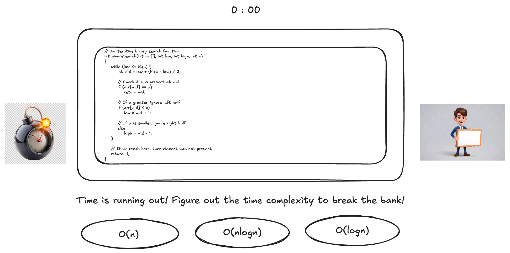
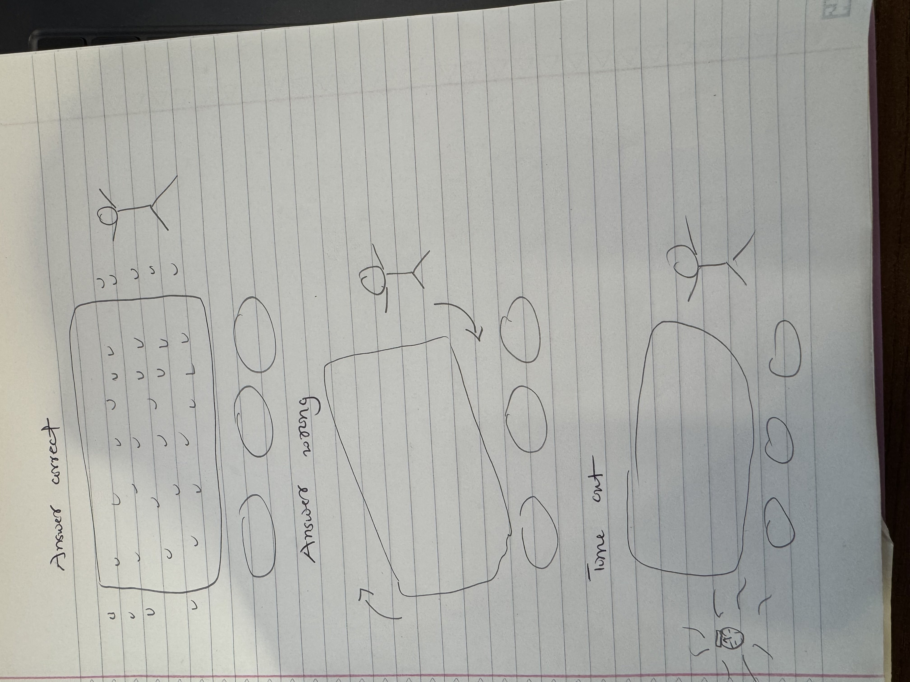

# Big-O Heist

## Elevator Pitch

*Big-O Heist* is a fast-paced educational game where players identify the Big-O time complexity of algorithm snippets under intense time pressure—with a digital avatar reacting to their choices and a ticking bomb ready to explode if they take too long.

## Influences (Brief)

- **Influence #1**:
  - Medium: Video Game (Overcooked)
  - Explanation: The fast-paced, cooperative tension of Overcooked inspired the game's sense of urgency and challenge-based learning.

- **Influence #2**:
  - Medium: Movie (Ocean’s Eleven)
  - Explanation: The strategic heist aesthetic and smooth execution align with the theme of codebreaking under pressure.

- **Influence #3**:
  - Medium: Television (Mr. Robot)
  - Explanation: The cyberpunk setting and hacker narrative reflect the tech-centric, algorithm-focused gameplay.

## Core Gameplay Mechanics (Brief)

- Timed algorithm identification
- Animated avatar reactions
- Bomb countdown pressure mechanic
- Multiple choice interface with immediate feedback

# Learning Aspects

## Learning Domains

- Computer Science: Algorithm analysis, time complexity
- Logical Reasoning: Pattern recognition and decision making
- Coding Interviews: Quick algorithm classification

## Target Audiences

- High school CS students
- Undergraduate CS students
- Coding bootcamp learners
- Interview prep enthusiasts

## Target Contexts

- CS classrooms and labs
- K-12 computer clubs
- Online independent learning platforms
- Interview preparation sessions

## Learning Objectives

- **Classify Complexity**: Learners will identify Big-O time complexity from algorithm snippets.
- **Decide Under Pressure**: Learners will make fast and accurate decisions under time constraints.
- **Recognize Code Patterns**: Learners will connect visual code patterns with their runtime behavior.

## Prerequisite Knowledge

- Understand for-loops, nested loops, and recursion
- Know basic algorithms like linear search, binary search, bubble sort, merge sort

## Assessment Measures

- Pre-/Post-tests with multiple choice questions
- Timed in-game scoring and accuracy tracking
- Example questions:
  - "What is the Big-O of binary search?"
  - "Classify the following nested loop structure."

# What sets this project apart?

- Uses visual urgency (avatar, bomb) to simulate coding pressure
- Immediate, meaningful feedback on correctness
- Combines education with game immersion
- Modular and replayable for lasting learning

# Player Interaction Patterns and Modes

## Player Interaction Pattern

Single-player interaction with game UI: choosing between 3 algorithm options, watching avatar and bomb feedback.

## Player Modes

- **Main Game (Heist Mode)**: 60-second rounds to identify Big-O complexities, with bomb threat and animated avatar reactions.
- **Practice Mode**: Unlimited time mode for exploration and learning.

# Gameplay Objectives

- **Primary Objective #1**:
  - Description: Identify Big-O complexity from a code snippet before time runs out.
  - Alignment: Reinforces classification learning objective.

- **Primary Objective #2**:
  - Description: Respond quickly to avoid avatar stress and bomb explosion.
  - Alignment: Reinforces decision-making under pressure.

# Procedures/Actions

- Player reads an algorithm snippet
- Selects one of three Big-O options via buttons
- Timer counts down from 60 seconds
- Avatar and bomb animate based on outcome

# Rules

- One minute per round
- One correct answer per question
- Game ends if timer hits zero (bomb explodes)

# Objects/Entities

- Algorithm snippet display
- Three Big-O choice buttons
- Animated avatar (happy, neutral, worried, shocked)
- Bomb (idle, shaking, explosion)
- Timer bar

## Core Gameplay Mechanics (Detailed)

- **Timed Algorithm Challenges**: Players must analyze code and respond quickly. The countdown timer, accompanied by a shaking bomb, drives urgency. Picking the correct option resets the timer; incorrect choices waste time.

- **Avatar Reactions**: An expressive avatar provides emotional feedback. It cheers, sighs, or panics depending on the player's decision. These animations increase emotional engagement.

- **Exploding Bomb**: The bomb shakes more violently as time runs out. If it explodes, it triggers an end-of-level animation and abrupt music cut-off, emphasizing the cost of indecision.

## Feedback

- **Visual**: Flash colors (green = correct, red = wrong), avatar animations, bomb pulsing
- **Audio**: Countdown tick, success/failure sound effects, explosion
- **Long-Term**: Post-game stats screen with accuracy and reaction times per round

# Story and Gameplay

## Presentation of Rules

Rules are introduced via interactive onboarding. The first level is a tutorial that gradually layers mechanics: selecting answers, observing avatar feedback, managing time.

## Presentation of Content

Each algorithm snippet is introduced with subtle hints or familiar code patterns. Players practice and reinforce recognition without lengthy explanations.

## Story (Brief)

You are a digital rogue hacker breaking into data vaults. Your digital avatar must make quick decisions to defuse algorithmic locks. One wrong move—or taking too long—and everything explodes.

## Storyboarding

# Assets Needed

## Aesthetics

A dark neon cyberpunk vibe. Tension-driven environment with glowing UI, high-tech overlays, and digital effects. The goal is to combine the look of a hacking mini-game with colorful emotional animation.

## Graphical

- **Characters**
  - Hacker Avatar: Animated with idle, happy, worried, and shocked states
- **Textures**
  - Bomb with glow, pulse, and explosion animation
  - UI buttons with hover/selected states
  - Terminal with floating algorithm snippets

## Audio

- **Music List (Ambient Sound)**
  - Tutorial / Start: Calm, synth-driven loop
  - Mid-game: Tension-building pulse
  - Final 10 seconds: Crescendo and ticking intensify

- **Sound List (SFX)**
  - Selecting answer: Soft click / chime
  - Correct: Celebration ding
  - Wrong: Error buzz
  - Timer ticking: Clock sound
  - Bomb explosion: Loud blast
  - Avatar reactions: Cheer, sigh, gasp
